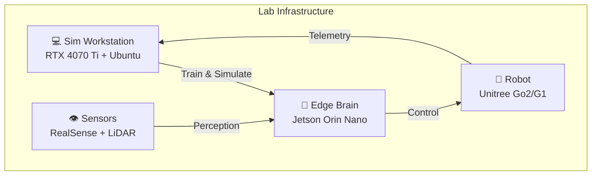
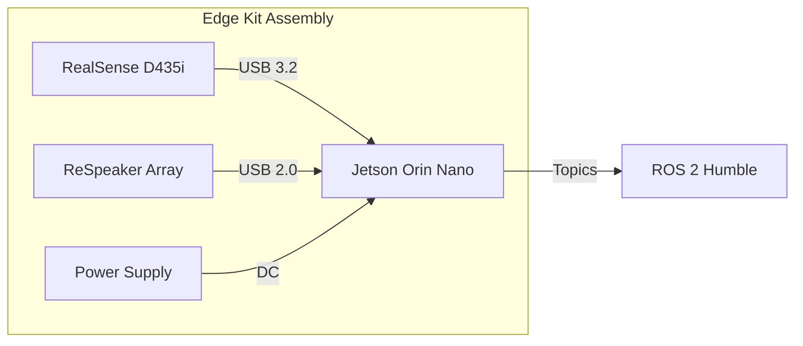

---
sidebar_position: 10
title: Hardware Lab Setup
slug: /hardware-lab
description: 'Complete hardware requirements for the Physical AI & Humanoid Robotics course'
---

# 🔧 Hardware Lab Requirements

:::danger Critical Hardware Warning
Standard laptops (**MacBooks** or **non-RTX Windows machines**) **will not work** for the simulation portion of this course. NVIDIA Isaac Sim requires RTX GPUs with ray-tracing capabilities.
:::

---## 🏗️ Lab Architecture Overview

---## 1. 💻 The "Digital Twin" Workstation

*Required per student for Modules 2 & 3*

:::info Why This Matters
NVIDIA Isaac Sim is an Omniverse application that requires **RTX (Ray Tracing)** capabilities. You need high VRAM to load USD assets for the robot and environment, plus run VLA models simultaneously.
:::

### Minimum Specifications

| Component | Minimum | Recommended | Reason |
|-----------|---------|-------------|--------|
| **GPU** | RTX 4070 Ti (12GB) | RTX 4090 (24GB) | USD asset rendering + Isaac Sim |
| **CPU** | Intel i7 13th Gen | AMD Ryzen 9 7950X | Rigid body physics (CPU-intensive) |
| **RAM** | 32 GB DDR5 | **64 GB DDR5** | Large scene loading without crashes |
| **Storage** | 512 GB NVMe | 1 TB NVMe | Datasets, models, simulations |
| **OS** | Ubuntu 22.04 LTS | Ubuntu 22.04 LTS | Native ROS 2 (Humble/Iron) |

### GPU Selection Guide

| GPU | VRAM | Isaac Sim | Training | Price |
|-----|------|-----------|----------|-------|
| RTX 4060 Ti | 8 GB | ⚠️ Limited | ❌ No | ~$400 |
| RTX 4070 Ti | 12 GB | ✅ Good | ⚠️ Small models | ~$700 |
| RTX 4080 | 16 GB | ✅ Great | ✅ Yes | ~$1,000 |
| **RTX 4090** | 24 GB | ✅ Ideal | ✅ Full VLA | ~$1,600 |
| RTX 3090 | 24 GB | ✅ Ideal | ✅ Full VLA | ~$900 (used) |

:::tip Budget Option
Used **RTX 3090** cards offer the same 24GB VRAM at a lower price point. Excellent for Sim-to-Real training workflows.
:::

---## 2. 🧠 The "Physical AI" Edge Kit

*Required for Module 3: Deploying the AI Brain*

This kit demonstrates real-world deployment constraints vs. powerful workstations.

### Component Breakdown

| Component | Model | Price | Purpose |
|-----------|-------|-------|---------|
| **The Brain** | NVIDIA Jetson Orin Nano Super (8GB) | ~$249 | Edge inference (40 TOPS) |
| **The Eyes** | Intel RealSense D435i | ~$349 | RGB + Depth + IMU for VSLAM |
| **The Ears** | ReSpeaker USB Mic Array v2.0 | ~$69 | Far-field voice commands |
| **Connectivity** | Included in Super Dev Kit | $0 | Wi-Fi module pre-installed |
| **Storage** | Samsung EVO 128GB microSD | ~$25 | High-endurance for OS |
| **Total** | | **~$700** | |

### Jetson Platform Comparison

| Device | AI Performance | Power | Use Case |
|--------|----------------|-------|----------|
| **Jetson Orin Nano** | 40 TOPS | 7-15W | Student projects, inference |
| Jetson Orin NX | 70-100 TOPS | 10-25W | Production robots |
| Jetson AGX Orin | 200-275 TOPS | 15-60W | High-end humanoids, training |

---## 3. 🤖 Robot Options

*Choose one tier based on your budget and goals*

### Option A: The "Proxy" Approach (Recommended for Budget)

:::tip Best Value
Use a quadruped as a proxy. The software principles (ROS 2, VSLAM, Isaac Sim) transfer **90% effectively** to humanoids.
:::

| Robot | Price | Features |
|-------|-------|----------|
| **Unitree Go2 Edu** | ~$3,000 | ROS 2 SDK, durable, excellent support |
| Unitree Go2 Pro | ~$1,600 | Limited SDK, consumer-focused |

**Pros**: Highly durable, can survive falls, excellent ROS 2 support  
**Cons**: Not bipedal (no walking gait practice)

### Option B: The "Miniature Humanoid" Approach

| Robot | Price | Features |
|-------|-------|----------|
| **Unitree G1** | ~$16,000 | Dynamic walking, manipulation capable |
| Robotis OP3 | ~$12,000 | Older but stable, research-focused |
| **Hiwonder TonyPi Pro** | ~$600 | Budget, Raspberry Pi-based |

:::warning TonyPi Limitations
The Hiwonder TonyPi runs on **Raspberry Pi** which cannot run NVIDIA Isaac ROS efficiently. Use for kinematics practice only—perception tasks require the Jetson.
:::

### Option C: The "Premium" Lab (Sim-to-Real)

For serious capstone deployment:

| Robot | Price | Why |
|-------|-------|-----|
| **Unitree G1** | ~$16,000 | One of the few commercially available humanoids with dynamic walking and open SDK |

---## 4. ☁️ Cloud Alternative (High OpEx)

If workstations are unavailable, rent cloud instances:

### AWS RoboMaker / GPU Instances

| Instance | GPU | VRAM | Cost/Hour | Use Case |
|----------|-----|------|-----------|----------|
| g5.xlarge | A10G | 24GB | ~$1.00 | Light simulation |
| **g5.2xlarge** | A10G | 24GB | ~$1.50 | Full Isaac Sim |
| g6e.xlarge | L40S | 48GB | ~$2.50 | Training + Sim |
| p4d.24xlarge | 8x A100 | 320GB | ~$32.00 | Large-scale training |

### Cost Calculation (Per Quarter)

| Item | Calculation | Cost |
|------|-------------|------|
| Instance (g5.2xlarge) | $1.50/hr × 10 hrs/week × 12 weeks | ~$180 |
| Storage (EBS) | 500GB @ $0.08/GB | ~$40 |
| Data Transfer | ~10GB/week | ~$10 |
| **Total Cloud Bill** | | **~$230** |

:::caution The Latency Trap
Simulating in the cloud works well, but **controlling a real robot from a cloud instance is dangerous** due to latency. 
1. **Latency**: VR/AR/Teleop is unusable with >50ms lag.
2. **Safety**: Real-time control loops (1kHz) cannot run over internet.

**Solution**: Train in the cloud, download the model, and flash it to the local Jetson.
:::

---## 📊 Summary: Lab Setup Options

### Option 1: On-Premise Lab (High CapEx)

| Item | Cost | Quantity | Total |
|------|------|----------|-------|
| RTX 4070 Ti Workstation | ~$2,000 | Per student | $2,000 |
| Jetson Edge Kit | ~$700 | Per student | $700 |
| Unitree Go2 (Shared) | ~$3,000 | 1 per 4 students | $750 |
| **Total Per Student** | | | **~$3,450** |

### Option 2: Cloud + Edge (High OpEx)

| Item | Cost | Duration | Total |
|------|------|----------|-------|
| Cloud Compute | ~$230 | Per quarter | $230 |
| Jetson Edge Kit | ~$700 | One-time | $700 |
| Robot (Shared) | ~$3,000 | Per 4 students | $750 |
| **Total Per Student (First Quarter)** | | | **~$1,680** |

---## 🔗 Purchase Links

| Component | Recommended Vendor |
|-----------|-------------------|
| NVIDIA Jetson | [NVIDIA Direct](https://developer.nvidia.com/buy-jetson) |
| Intel RealSense | [Intel Store](https://www.intelrealsense.com/) |
| Unitree Robots | [Unitree Direct](https://www.unitree.com/) |
| ReSpeaker | [Seeed Studio](https://www.seeedstudio.com/) |
| RTX GPUs | [NVIDIA Partners](https://www.nvidia.com/en-us/geforce/buy/) |
