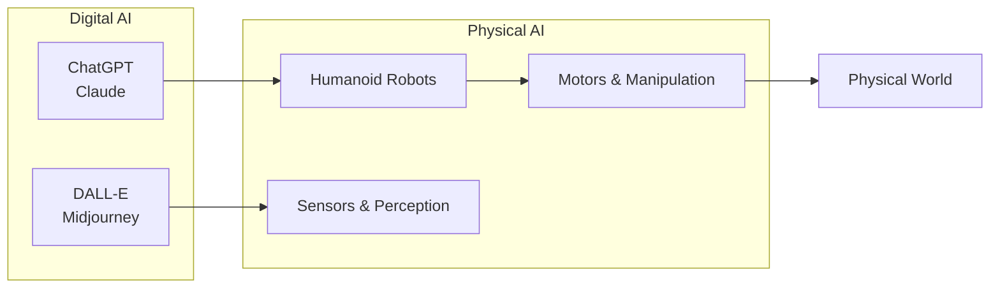

# 🤖 Physical AI & Humanoid Robotics

import { PersonalizationButton, UrduTranslationButton, ButtonContainer } from '@site/src/components/ModuleButtons';

<ButtonContainer>
    <PersonalizationButton />
    <UrduTranslationButton />
</ButtonContainer>

> **The future of work** will be a partnership between people, intelligent agents (AI software), and robots. This shift won't necessarily eliminate jobs but will change what humans do, leading to a massive demand for new skills.

:::info Course Goals
| Aspect | Description |
|--------|-------------|
| **Focus** | AI Systems in the Physical World |
| **Theme** | Embodied Intelligence |
| **Duration** | 13 Weeks (1 Quarter) |
| **Outcome** | Deploy humanoid robots in simulated and real-world environments |
:::

---

## 🌟 Why Physical AI Matters

Humanoid robots are poised to excel in our human-centered world because they share our physical form and can be trained with abundant data from interacting in human environments.

This represents a significant transition from AI models confined to digital environments to **embodied intelligence** that operates in physical space.

---

## 📚 Learning Outcomes

By the end of this course, you will be able to:

| # | Outcome |
|---|---------|
| 1 | Understand **Physical AI principles** and embodied intelligence |
| 2 | Master **ROS 2** (Robot Operating System) for robotic control |
| 3 | Simulate robots with **Gazebo** and **Unity** |
| 4 | Develop with **NVIDIA Isaac** AI robot platform |
| 5 | Design humanoid robots for **natural interactions** |
| 6 | Integrate **GPT models** for conversational robotics |
| 7 | Deploy a capstone **Autonomous Humanoid** project |

---

## 📅 Complete 13-Week Curriculum

### Phase 1: Foundations (Weeks 1-5)

| Week | Topic | Description |
|------|-------|-------------|
| **[Week 1-2](/docs/week-01-02-intro)** | Introduction to Physical AI | Embodied intelligence, humanoid landscape, sensor systems |
| **[Week 3-5](/docs/week-03-05-ros2)** | ROS 2 Fundamentals | Nodes, Topics, Services, Actions, Packages, Launch files |

### Phase 2: Simulation (Weeks 6-7)

| Week | Topic | Description |
|------|-------|-------------|
| **[Week 6-7](/docs/week-06-07-gazebo)** | Robot Simulation | Gazebo, URDF/SDF, Physics, Sensor plugins, Unity |

### Phase 3: AI Brain (Weeks 8-10)

| Week | Topic | Description |
|------|-------|-------------|
| **[Week 8-10](/docs/week-08-10-isaac)** | NVIDIA Isaac Platform | Isaac Sim, VSLAM, Nvblox, Nav2, Sim-to-Real |

### Phase 4: Humanoid Development (Weeks 11-13)

| Week | Topic | Description |
|------|-------|-------------|
| **[Week 11-12](/docs/week-11-12-humanoid)** | Humanoid Development | Kinematics, dynamics, bipedal locomotion, manipulation |
| **[Week 13](/docs/week-13-conversational)** | Conversational Robotics | GPT integration, Whisper, multi-modal interaction |

---

## 🎓 Assessments

| Assessment | Description | Weight |
|------------|-------------|--------|
| **ROS 2 Package** | Create nodes, topics, services | 20% |
| **Gazebo Simulation** | Robot in custom world with sensors | 20% |
| **Isaac Pipeline** | VSLAM and navigation | 20% |
| **Capstone Project** | Autonomous humanoid with voice control | 40% |

---

## 💻 Hardware Requirements

:::warning High Performance Required
This course requires **RTX GPUs** for NVIDIA Isaac Sim. Standard laptops will not work.
:::

### Quick Reference

| Component | Requirement |
|-----------|-------------|
| **GPU** | NVIDIA RTX 4070 Ti (12GB+) |
| **CPU** | Intel i7 13th Gen+ or AMD Ryzen 9 |
| **RAM** | 64 GB DDR5 |
| **OS** | Ubuntu 22.04 LTS |
| **Edge** | NVIDIA Jetson Orin Nano |

👉 See the complete **[Hardware Lab Setup](/docs/hardware-lab)** for detailed specifications and purchase links.

---

## 🚀 Getting Started

1. **Set up your workstation** with Ubuntu 22.04 and necessary drivers
2. **Install ROS 2 Humble** following the Week 3 guide
3. **Configure Gazebo** for robot simulation
4. **Install Isaac Sim** (requires NVIDIA Omniverse)
5. **Get your edge kit** (Jetson + RealSense)

---

## 📖 Course Modules Quick Links

| Module | Focus | Link |
|--------|-------|------|
| 🌟 **Introduction** | Physical AI Foundations | [Weeks 1-2](/docs/week-01-02-intro) |
| 🤖 **ROS 2** | Robot Operating System | [Weeks 3-5](/docs/week-03-05-ros2) |
| 🏗️ **Simulation** | Gazebo & Unity | [Weeks 6-7](/docs/week-06-07-gazebo) |
| 🧠 **Isaac** | NVIDIA Platform | [Weeks 8-10](/docs/week-08-10-isaac) |
| 🦿 **Humanoid** | Kinematics & Walking | [Weeks 11-12](/docs/week-11-12-humanoid) |
| 🗣️ **Conversational** | GPT & Voice | [Week 13](/docs/week-13-conversational) |
| 🔧 **Hardware** | Lab Setup | [Hardware Lab](/docs/hardware-lab) |

---

## 🔗 Resources

- [ROS 2 Humble Documentation](https://docs.ros.org/en/humble/)
- [NVIDIA Isaac Documentation](https://docs.omniverse.nvidia.com/isaacsim/)
- [Gazebo Sim](https://gazebosim.org/docs)
- [Panaversity](https://panaversity.org)

