---

import { PersonalizationButton, UrduTranslationButton, ButtonContainer } from '@site/src/components/ModuleButtons';

<ButtonContainer>
  <PersonalizationButton />
  <UrduTranslationButton />
</ButtonContainer>

# 🌟 Foundations of Physical AI & Humanoid Robotics

:::info Module Goals
By the end of these two weeks, you will be able to:
- **Differentiate** between Generative AI (Digital) and Physical AI (Embodied).
- **Explain** the "Sense-Plan-Act" loop in the context of latency and physics.
- **Analyze** the sensor suite of a modern humanoid (LiDAR vs. Vision).
- **Understand** the "Brain-Body" disconnect (Sim-to-Real gap).
:::

---

## 📆 Week 1: The Era of Embodied Intelligence

### 1.1 Beyond the Chatbot: What is Physical AI?

We are witnessing a paradigm shift. For the last decade, "AI" meant software that processes information—text, images, code. **Physical AI** is software that processes **matter and energy**.

| Feature | Generative AI (LLMs) | Physical AI (Robotics) |
| :--- | :--- | :--- |
| **Domain** | Digital (Bits) | Physical (Atoms) |
| **Consequences** | Hallucination, Bad Code | Collision, Damage, Injury |
| **Latency** | 500ms - 5s (Acceptable) | < 10ms (Critical for balance) |
| **Data Source** | Internet Text/Images | Real-world highly correlated sensor stream |
| **Feedback Loop** | Open-loop (mostly) | Closed-loop (Action changes Perception) |

> **Key Concept:** **Moravec's Paradox**
> *"It is comparatively easy to make computers exhibit adult level performance on intelligence tests or playing checkers, and difficult or impossible to give them the skills of a one-year-old when it comes to perception and mobility."*

### 1.2 The Sense-Plan-Act Loop

Every robot, from a Roomba to a Tesla Optimus, follows this fundamental cycle. In Physical AI, we are replacing hard-coded "Plan" modules with learned Neural Networks.

```mermaid
graph TD
    subgraph "Real World"
        World[Physics & Environment]
    end

    subgraph "The Robot"
        Sensors[👁️ SENSE<br/>Cameras, IMU, Encoders]
        Compute[🧠 PLAN/THINK<br/>VLA Model / Policy]
        Actuators[💪 ACT<br/>Motors, Grippers]
    end

    World -->|Light/Force| Sensors
    Sensors -->|Data Stream| Compute
    Compute -->|Motor Commands| Actuators
    Actuators -->|Torque/Force| World
```



### 1.3 The Evolution of Humanoids

*   **Generation 1 (Static Industrial):** Unimate (1960s). Strong but blind and deaf. Dangerous to be around.
*   **Generation 2 (Walking Research):** Honda ASIMO (2000s). Could walk, but fragile. Zero cognitive intelligence. Cost: $1M+.
*   **Generation 3 (Dynamic Athletics):** Boston Dynamics Atlas (2010s). Hydraulic, backflips, agile. Hard-coded control theory.
*   **Generation 4 (Embodied AI):** Tesla Optimus, Unitree G1 (2024+). Vision-centric, trained via Imitation Learning & RL. Designed for mass manufacturing.

---

## 📆 Week 2: Hardware & The Senses

### 2.1 Exteroception: Seeing the World

Humanoids need to map their environment to navigate and manipulate it.

#### Option A: LiDAR (Light Detection and Ranging)
-   **How it works:** Shoots laser pulses and measures return time (Time-of-Flight).
-   **Pros:** Perfect depth accuracy, works in dark, long range.
-   **Cons:** Expensive, sparse resolution, no color/texture, confused by glass/mirrors.
-   **Robots:** Unitree Go2, most ROS 2 research bots.

#### Option B: Stereo Vision (RGB-D)
-   **How it works:** Two cameras offset by a baseline (like human eyes). Parallax provides depth.
-   **Pros:** Cheap, dense color information, rich semantic data (can read text).
-   **Cons:** Struggles with textureless walls (white walls), sensitive to lighting.
-   **Robots:** Tesla Optimus (Vision only), Human eye.

#### Option C: Active Depth (Structured Light)
-   **How it works:** Projects an IR dot pattern and reads distortion.
-   **Pros:** Great for close-range manipulation.
-   **Cons:** Fails in sunlight (IR interference).
-   **Robots:** Intel RealSense, Microsoft Kinect.

### 2.2 Proprioception: Feeling the Body

Before a robot can move, it must know *where it is*.

1.  **IMU (Inertial Measurement Unit):** The inner ear. Measures linear acceleration and angular velocity. Essential for balance.
2.  **Encoders:** Sensors inside motors that count rotations like a clock. Tells the robot "My elbow is bent 45 degrees."
3.  **Force/Torque Sensors:** Captures contact forces. "I am holding an egg" vs "I am crushing a rock."

### 2.3 Actuation: The Muscles

Why don't we use hydraulic pistons anymore?

*   **BLDC (Brushless DC) Motors:** The standard for modern robotics. High efficiency, precise control.
*   **Quasi-Direct Drive (QDD):** High torque motor + low gear ratio (6:1 to 10:1). Allows the motor to be "back-drivable" (compliant). If you push the robot, it moves, rather than breaking gears. This makes them safe for human interaction.

---

## 🔬 Lab 1: Setting Up Your Environment

Before next week's ROS 2 Deep Dive, you must have your "Digital Twin" environment ready.

### Hardware Check
-   [ ] **GPU:** Verify you have an NVIDIA RTX card installed.
-   [ ] **Drivers:** Install NVIDIA drivers (version 535+).
    ```bash
    nvidia-smi
    ```
-   [ ] **OS:** Confirm you are running Ubuntu 22.04 LTS (Dual boot or dedicated). **WSL2 is NOT recommended** for hardware interfacing.

### Software Installation
1.  **Install terminator:** A better terminal emulator.
    ```bash
    sudo apt install terminator
    ```
2.  **Install VS Code:** Your primary IDE.
3.  **Install Docker:** We will use containers for some exercises.

### Safety First!
> **⚠️ WARNING:** When we start working with real motors in Week 3, **ALWAYS** have an emergency stop (E-Stop) procedure. A 10kg robot moving at 2m/s can break a finger or worse.

---

## 🔗 Deep Dive Resources

-   **Read:** ["The Bitter Lesson" by Rich Sutton](http://www.incompleteideas.net/IncIdeas/BitterLesson.html) - Why learning beats hand-coding.
-   **Watch:** [Andrej Karpathy on State of GPT](https://www.youtube.com/watch?v=bZQun8Y4L2A) (Relevance to robotics starts at 30:00).
-   **Paper:** [Learning Fine-Grained Bimanual Manipulation with Low-Cost Hardware](https://tonyzhaozh.github.io/aloha/) (ALOHA Project).
