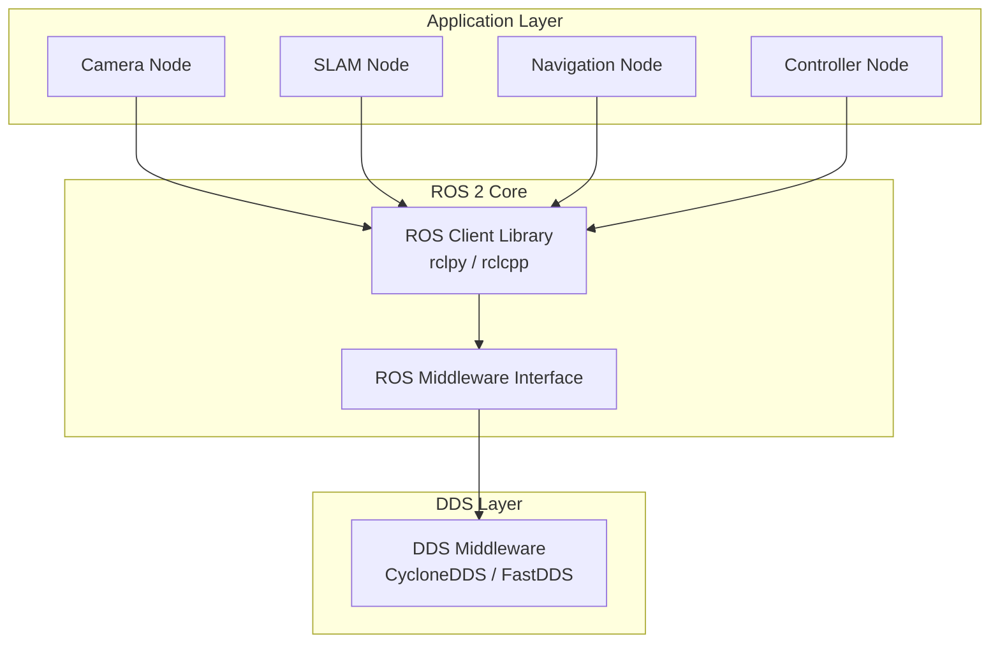
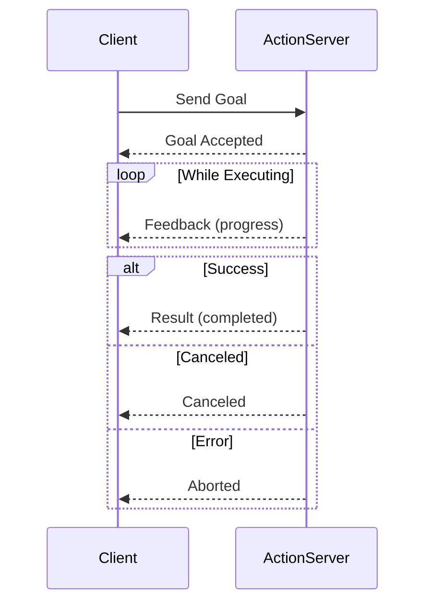

---
sidebar_position: 3
title: 'Weeks 3-5: ROS 2 Fundamentals'
description: 'ROS 2 Architecture, Nodes, Topics, Services, Actions, and Python Development'
---


---

import { PersonalizationButton, UrduTranslationButton, ButtonContainer } from '@site/src/components/ModuleButtons';

<ButtonContainer>
  <PersonalizationButton />
  <UrduTranslationButton />
</ButtonContainer>

# 🤖 ROS 2 Fundamentals


:::info Weekly Overview
| Week | Focus | Key Topics |
|------|-------|------------|
| **Week 3** | ROS 2 Architecture | Core concepts, DDS, installation |
| **Week 4** | Communication | Nodes, Topics, Services, Actions |
| **Week 5** | Development | Packages, Launch files, Parameters |
:::

---## 📆 Week 3: ROS 2 Architecture and Core Concepts

### Why ROS 2?

| Feature | ROS 1 | ROS 2 |
|---------|-------|-------|
| **Middleware** | Custom (TCPROS) | DDS (Data Distribution Service) |
| **Real-time** | ❌ No | ✅ Yes |
| **Multi-robot** | Difficult | ✅ Native support |
| **Security** | ❌ None | ✅ DDS-Security |
| **OS Support** | Linux only | Linux, Windows, macOS |
| **Python** | Python 2 | Python 3 |

### ROS 2 Architecture



### Installation on Ubuntu 22.04

```bash
# Set locale
sudo apt update && sudo apt install locales
sudo locale-gen en_US en_US.UTF-8
sudo update-locale LC_ALL=en_US.UTF-8 LANG=en_US.UTF-8
export LANG=en_US.UTF-8

# Add ROS 2 apt repository
sudo apt install software-properties-common
sudo add-apt-repository universe
sudo apt update && sudo apt install curl -y
sudo curl -sSL https://raw.githubusercontent.com/ros/rosdistro/master/ros.key -o /usr/share/keyrings/ros-archive-keyring.gpg
echo "deb [arch=$(dpkg --print-architecture) signed-by=/usr/share/keyrings/ros-archive-keyring.gpg] http://packages.ros.org/ros2/ubuntu $(. /etc/os-release && echo $UBUNTU_CODENAME) main" | sudo tee /etc/apt/sources.list.d/ros2.list > /dev/null

# Install ROS 2 Humble (Desktop Full)
sudo apt update
sudo apt install ros-humble-desktop-full

# Source ROS 2
echo "source /opt/ros/humble/setup.bash" >> ~/.bashrc
source ~/.bashrc

# Install development tools
sudo apt install python3-colcon-common-extensions python3-rosdep
sudo rosdep init
rosdep update
```

### Core Concepts

| Concept | Description | Example |
|---------|-------------|---------|
| **Node** | A single executable that uses ROS to communicate | `camera_node`, `motor_controller` |
| **Topic** | Named bus for nodes to publish/subscribe messages | `/camera/image_raw` |
| **Service** | Request/response communication | `/get_battery_level` |
| **Action** | Long-running task with feedback | `/navigate_to_pose` |
| **Parameter** | Configuration values at runtime | `max_velocity: 1.5` |
| **Message** | Data structure for communication | `sensor_msgs/Image` |

---## 📆 Week 4: Nodes, Topics, Services, and Actions

### ROS 2 Nodes


```python
#!/usr/bin/env python3
"""Basic ROS 2 Node Template"""

import rclpy
from rclpy.node import Node


class MinimalNode(Node):
    """A minimal ROS 2 node."""
    
    def __init__(self):
        super().__init__('minimal_node')
        self.get_logger().info('Node started!')
        
        # Create a timer that fires every 1 second
        self.timer = self.create_timer(1.0, self.timer_callback)
        self.counter = 0
    
    def timer_callback(self):
        self.counter += 1
        self.get_logger().info(f'Timer fired: {self.counter}')


def main(args=None):
    rclpy.init(args=args)
    node = MinimalNode()
    
    try:
        rclpy.spin(node)
    except KeyboardInterrupt:
        pass
    finally:
        node.destroy_node()
        rclpy.shutdown()


if __name__ == '__main__':
    main()
```

### Topics: Publish/Subscribe Communication

```mermaid
graph LR
    subgraph "Publishers"
        Cam[Camera Node]
        Lidar[LiDAR Node]
    end
    
    subgraph "Topics"
        T1[/camera/image_raw]
        T2[/scan]
    end
    
    subgraph "Subscribers"
        SLAM[SLAM Node]
        Viz[Visualization]
    end
    
    Cam -->|publish| T1
    Lidar -->|publish| T2
    T1 -->|subscribe| SLAM
    T1 -->|subscribe| Viz
    T2 -->|subscribe| SLAM
```

```python
#!/usr/bin/env python3
"""Publisher and Subscriber Example"""

import rclpy
from rclpy.node import Node
from std_msgs.msg import String
from geometry_msgs.msg import Twist


class TwistPublisher(Node):
    """Publishes velocity commands."""
    
    def __init__(self):
        super().__init__('twist_publisher')
        self.publisher = self.create_publisher(Twist, '/cmd_vel', 10)
        self.timer = self.create_timer(0.1, self.publish_cmd)  # 10 Hz
        
    def publish_cmd(self):
        msg = Twist()
        msg.linear.x = 0.5   # Move forward at 0.5 m/s
        msg.angular.z = 0.1  # Slight rotation
        self.publisher.publish(msg)


class TwistSubscriber(Node):
    """Subscribes to velocity commands."""
    
    def __init__(self):
        super().__init__('twist_subscriber')
        self.subscription = self.create_subscription(
            Twist,
            '/cmd_vel',
            self.cmd_callback,
            10
        )
    
    def cmd_callback(self, msg: Twist):
        self.get_logger().info(
            f'Received: linear.x={msg.linear.x:.2f}, angular.z={msg.angular.z:.2f}'
        )
```

### Services: Request/Response

```python
#!/usr/bin/env python3
"""Service Server and Client Example"""

from example_interfaces.srv import AddTwoInts
import rclpy
from rclpy.node import Node


class AdditionServer(Node):
    """Service server that adds two integers."""
    
    def __init__(self):
        super().__init__('addition_server')
        self.service = self.create_service(
            AddTwoInts,
            'add_two_ints',
            self.add_callback
        )
        self.get_logger().info('Addition service ready')
    
    def add_callback(self, request, response):
        response.sum = request.a + request.b
        self.get_logger().info(f'{request.a} + {request.b} = {response.sum}')
        return response


class AdditionClient(Node):
    """Service client that requests addition."""
    
    def __init__(self):
        super().__init__('addition_client')
        self.client = self.create_client(AddTwoInts, 'add_two_ints')
        
        # Wait for service
        while not self.client.wait_for_service(timeout_sec=1.0):
            self.get_logger().info('Waiting for service...')
    
    def call_service(self, a: int, b: int):
        request = AddTwoInts.Request()
        request.a = a
        request.b = b
        
        future = self.client.call_async(request)
        rclpy.spin_until_future_complete(self, future)
        
        return future.result().sum
```

### Actions: Long-Running Tasks with Feedback



```python
#!/usr/bin/env python3
"""Action Server for Navigation"""

from nav2_msgs.action import NavigateToPose
from rclpy.action import ActionServer, GoalResponse, CancelResponse
from rclpy.node import Node
import rclpy


class NavigationServer(Node):
    """Action server for navigation."""
    
    def __init__(self):
        super().__init__('navigation_server')
        
        self.action_server = ActionServer(
            self,
            NavigateToPose,
            'navigate_to_pose',
            execute_callback=self.execute_callback,
            goal_callback=self.goal_callback,
            cancel_callback=self.cancel_callback
        )
    
    def goal_callback(self, goal_request):
        self.get_logger().info('Received goal request')
        return GoalResponse.ACCEPT
    
    def cancel_callback(self, goal_handle):
        self.get_logger().info('Received cancel request')
        return CancelResponse.ACCEPT
    
    async def execute_callback(self, goal_handle):
        self.get_logger().info('Executing navigation...')
        
        feedback_msg = NavigateToPose.Feedback()
        
        # Simulate navigation with feedback
        for i in range(10):
            if goal_handle.is_cancel_requested:
                goal_handle.canceled()
                return NavigateToPose.Result()
            
            # Update feedback
            feedback_msg.distance_remaining = float(10 - i)
            goal_handle.publish_feedback(feedback_msg)
            
            await asyncio.sleep(1.0)  # Simulate work
        
        goal_handle.succeed()
        
        result = NavigateToPose.Result()
        return result
```

---## 📆 Week 5: Building ROS 2 Packages with Python

### Package Structure

```
my_robot_package/
├── my_robot_package/       # Python module
│   ├── __init__.py
│   ├── camera_node.py
│   ├── motor_controller.py
│   └── navigation_node.py
├── launch/                  # Launch files
│   ├── robot_bringup.launch.py
│   └── simulation.launch.py
├── config/                  # Parameter files
│   ├── robot_params.yaml
│   └── navigation_params.yaml
├── msg/                     # Custom messages
│   └── RobotStatus.msg
├── srv/                     # Custom services
│   └── GetStatus.srv
├── package.xml             # Package metadata
├── setup.py                # Python package setup
└── setup.cfg               # Entry points configuration
```

### Creating a Package

```bash
# Create workspace
mkdir -p ~/ros2_ws/src
cd ~/ros2_ws/src

# Create package
ros2 pkg create --build-type ament_python my_humanoid_pkg \
    --dependencies rclpy std_msgs geometry_msgs sensor_msgs

# Build
cd ~/ros2_ws
colcon build --packages-select my_humanoid_pkg

# Source
source install/setup.bash
```

### Launch Files

```python
# launch/humanoid_bringup.launch.py
from launch import LaunchDescription
from launch_ros.actions import Node
from launch.actions import DeclareLaunchArgument, IncludeLaunchDescription
from launch.substitutions import LaunchConfiguration, PathJoinSubstitution
from launch_ros.substitutions import FindPackageShare


def generate_launch_description():
    # Declare arguments
    use_sim_time = LaunchConfiguration('use_sim_time')
    
    # Load parameters from YAML
    params_file = PathJoinSubstitution([
        FindPackageShare('my_humanoid_pkg'),
        'config',
        'robot_params.yaml'
    ])
    
    return LaunchDescription([
        # Arguments
        DeclareLaunchArgument(
            'use_sim_time',
            default_value='false',
            description='Use simulation clock'
        ),
        
        # Camera Node
        Node(
            package='my_humanoid_pkg',
            executable='camera_node',
            name='camera_node',
            parameters=[
                params_file,
                {'use_sim_time': use_sim_time}
            ],
            remappings=[
                ('/image_raw', '/camera/color/image_raw'),
            ]
        ),
        
        # Motor Controller
        Node(
            package='my_humanoid_pkg',
            executable='motor_controller',
            name='motor_controller',
            parameters=[{'use_sim_time': use_sim_time}],
            output='screen'
        ),
        
        # Navigation
        Node(
            package='my_humanoid_pkg',
            executable='navigation_node',
            name='navigation',
            parameters=[params_file]
        ),
    ])
```

### Parameter Management

```yaml
# config/robot_params.yaml
camera_node:
  ros__parameters:
    image_width: 640
    image_height: 480
    frame_rate: 30.0
    camera_frame: "camera_link"

motor_controller:
  ros__parameters:
    max_linear_velocity: 1.0  # m/s
    max_angular_velocity: 2.0  # rad/s
    wheel_radius: 0.05  # meters
    wheel_separation: 0.3  # meters
    
navigation:
  ros__parameters:
    goal_tolerance: 0.1  # meters
    obstacle_range: 2.5  # meters
    raytrace_range: 3.0  # meters
```

```python
# Accessing parameters in code
class MotorController(Node):
    def __init__(self):
        super().__init__('motor_controller')
        
        # Declare parameters with defaults
        self.declare_parameter('max_linear_velocity', 1.0)
        self.declare_parameter('max_angular_velocity', 2.0)
        
        # Get parameter values
        self.max_linear = self.get_parameter('max_linear_velocity').value
        self.max_angular = self.get_parameter('max_angular_velocity').value
        
        self.get_logger().info(f'Max velocity: linear={self.max_linear}, angular={self.max_angular}')
        
        # Parameter change callback
        self.add_on_set_parameters_callback(self.parameter_callback)
    
    def parameter_callback(self, params):
        for param in params:
            if param.name == 'max_linear_velocity':
                self.max_linear = param.value
                self.get_logger().info(f'Updated max_linear to {param.value}')
        return SetParametersResult(successful=True)
```

---## 🎯 Learning Outcomes for Weeks 3-5

By the end of these weeks, you will:

- [x] Understand **ROS 2 architecture** and the **DDS middleware**
- [x] Create and manage **Nodes, Topics, Services, and Actions**
- [x] Build **ROS 2 packages** with Python using `ament_python`
- [x] Write **Launch files** for multi-node orchestration
- [x] Manage **Parameters** using YAML files and runtime APIs
- [x] Use common **message types** (Twist, Image, LaserScan)

---## 📝 Assessment: ROS 2 Package Development Project

### Requirements

Create a ROS 2 package called `humanoid_controller` that includes:

| Component | Description | Points |
|-----------|-------------|--------|
| **Talker Node** | Publishes joint commands to `/joint_commands` | 20 |
| **Listener Node** | Subscribes and logs received commands | 20 |
| **Service** | `/get_joint_states` returns current positions | 20 |
| **Action** | `/move_arm` executes arm movement with feedback | 25 |
| **Launch File** | Starts all nodes with parameters | 15 |

### Submission Checklist

- [ ] Package builds without errors (`colcon build`)
- [ ] All nodes start via launch file
- [ ] Topics visible in `ros2 topic list`
- [ ] Service responds to requests
- [ ] Action provides feedback during execution
- [ ] Parameters loaded from YAML file

---## 🔗 Resources

- [ROS 2 Humble Documentation](https://docs.ros.org/en/humble/)
- [rclpy API Reference](https://docs.ros2.org/latest/api/rclpy/)
- [ROS 2 Tutorials](https://docs.ros.org/en/humble/Tutorials.html)
- [Colcon Build Tool](https://colcon.readthedocs.io/)
