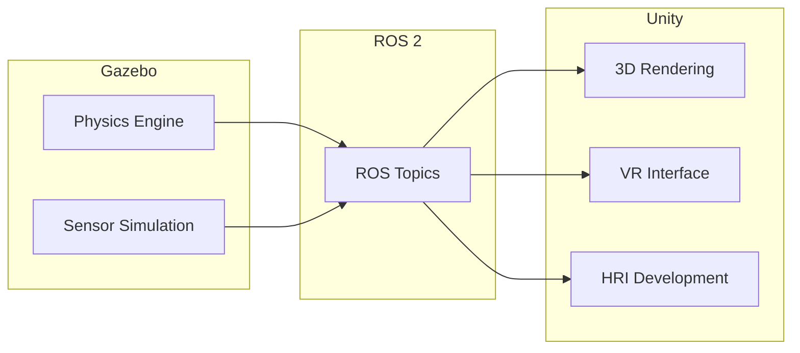

---
sidebar_position: 4
title: 'Weeks 6-7: Robot Simulation with Gazebo'
description: 'Gazebo Environment Setup, URDF/SDF, Physics and Sensor Simulation'
---


---

import { PersonalizationButton, UrduTranslationButton, ButtonContainer } from '@site/src/components/ModuleButtons';

<ButtonContainer>
  <PersonalizationButton />
  <UrduTranslationButton />
</ButtonContainer>

# 🏗️ Robot Simulation with Gazebo


:::info Weekly Overview
| Week | Focus | Key Topics |
|------|-------|------------|
| **Week 6** | Gazebo Setup | Installation, URDF, SDF, World building |
| **Week 7** | Advanced Sim | Sensor plugins, Unity integration, Physics tuning |
:::

---## 📆 Week 6: Gazebo Simulation Environment Setup

### Why Simulate?

| Benefit | Description |
|---------|-------------|
| **Safety** | No risk of hardware damage |
| **Speed** | Faster than real-time testing possible |
| **Cost** | No robot hardware required initially |
| **Reproducibility** | Exact same conditions every test |
| **Edge Cases** | Test scenarios too dangerous for real robots |

### Installation

```bash
# Install Gazebo Fortress (LTS) for ROS 2 Humble
sudo apt update
sudo apt install ros-humble-gazebo-ros-pkgs ros-humble-gazebo-ros2-control

# Install additional Gazebo tools
sudo apt install ros-humble-robot-state-publisher \
                 ros-humble-joint-state-publisher \
                 ros-humble-xacro

# Verify installation
gz sim --version
```

### URDF (Unified Robot Description Format)


```xml
<?xml version="1.0"?>
<robot name="simple_humanoid" xmlns:xacro="http://ros.org/wiki/xacro">
  
  <!-- Materials -->
  <material name="white">
    <color rgba="1.0 1.0 1.0 1.0"/>
  </material>
  <material name="blue">
    <color rgba="0.2 0.2 0.8 1.0"/>
  </material>
  
  <!-- Base Link (Torso) -->
  <link name="base_link">
    <visual>
      <geometry>
        <box size="0.3 0.2 0.5"/>
      </geometry>
      <material name="blue"/>
    </visual>
    <collision>
      <geometry>
        <box size="0.3 0.2 0.5"/>
      </geometry>
    </collision>
    <inertial>
      <mass value="10.0"/>
      <origin xyz="0 0 0"/>
      <inertia ixx="0.4" ixy="0" ixz="0" iyy="0.4" iyz="0" izz="0.2"/>
    </inertial>
  </link>
  
  <!-- Head -->
  <link name="head_link">
    <visual>
      <geometry>
        <sphere radius="0.1"/>
      </geometry>
      <material name="white"/>
    </visual>
    <collision>
      <geometry>
        <sphere radius="0.1"/>
      </geometry>
    </collision>
    <inertial>
      <mass value="2.0"/>
      <inertia ixx="0.01" ixy="0" ixz="0" iyy="0.01" iyz="0" izz="0.01"/>
    </inertial>
  </link>
  
  <!-- Neck Joint -->
  <joint name="neck_joint" type="revolute">
    <parent link="base_link"/>
    <child link="head_link"/>
    <origin xyz="0 0 0.35" rpy="0 0 0"/>
    <axis xyz="0 0 1"/>
    <limit lower="-1.57" upper="1.57" effort="10" velocity="1.0"/>
  </joint>
  
  <!-- Left Arm -->
  <link name="left_upper_arm">
    <visual>
      <origin xyz="0 0 -0.15"/>
      <geometry>
        <cylinder radius="0.04" length="0.3"/>
      </geometry>
      <material name="blue"/>
    </visual>
    <collision>
      <origin xyz="0 0 -0.15"/>
      <geometry>
        <cylinder radius="0.04" length="0.3"/>
      </geometry>
    </collision>
    <inertial>
      <mass value="1.5"/>
      <origin xyz="0 0 -0.15"/>
      <inertia ixx="0.01" ixy="0" ixz="0" iyy="0.01" iyz="0" izz="0.002"/>
    </inertial>
  </link>
  
  <joint name="left_shoulder_joint" type="revolute">
    <parent link="base_link"/>
    <child link="left_upper_arm"/>
    <origin xyz="0 0.15 0.2" rpy="0 0 0"/>
    <axis xyz="1 0 0"/>
    <limit lower="-3.14" upper="3.14" effort="50" velocity="2.0"/>
  </joint>
  
  <!-- Left Leg -->
  <link name="left_thigh">
    <visual>
      <origin xyz="0 0 -0.2"/>
      <geometry>
        <cylinder radius="0.05" length="0.4"/>
      </geometry>
      <material name="blue"/>
    </visual>
    <collision>
      <origin xyz="0 0 -0.2"/>
      <geometry>
        <cylinder radius="0.05" length="0.4"/>
      </geometry>
    </collision>
    <inertial>
      <mass value="3.0"/>
      <origin xyz="0 0 -0.2"/>
      <inertia ixx="0.04" ixy="0" ixz="0" iyy="0.04" iyz="0" izz="0.01"/>
    </inertial>
  </link>
  
  <joint name="left_hip_pitch" type="revolute">
    <parent link="base_link"/>
    <child link="left_thigh"/>
    <origin xyz="0 0.1 -0.25" rpy="0 0 0"/>
    <axis xyz="0 1 0"/>
    <limit lower="-1.57" upper="0.5" effort="100" velocity="2.0"/>
  </joint>
  
</robot>
```

### SDF (Simulation Description Format)

SDF is more feature-rich than URDF for simulation:

```xml
<?xml version="1.0" ?>
<sdf version="1.8">
  <world name="humanoid_world">
    
    <!-- Physics Configuration -->
    <physics type="ode">
      <max_step_size>0.001</max_step_size>
      <real_time_factor>1.0</real_time_factor>
      <real_time_update_rate>1000</real_time_update_rate>
      <gravity>0 0 -9.81</gravity>
    </physics>
    
    <!-- Lighting -->
    <light type="directional" name="sun">
      <cast_shadows>true</cast_shadows>
      <pose>0 0 10 0 0 0</pose>
      <diffuse>0.8 0.8 0.8 1</diffuse>
      <specular>0.2 0.2 0.2 1</specular>
      <attenuation>
        <range>1000</range>
        <constant>0.9</constant>
        <linear>0.01</linear>
        <quadratic>0.001</quadratic>
      </attenuation>
      <direction>-0.5 0.1 -0.9</direction>
    </light>
    
    <!-- Ground Plane -->
    <model name="ground_plane">
      <static>true</static>
      <link name="link">
        <collision name="collision">
          <geometry>
            <plane>
              <normal>0 0 1</normal>
              <size>100 100</size>
            </plane>
          </geometry>
          <surface>
            <friction>
              <ode>
                <mu>0.8</mu>
                <mu2>0.8</mu2>
              </ode>
            </friction>
          </surface>
        </collision>
        <visual name="visual">
          <geometry>
            <plane>
              <normal>0 0 1</normal>
              <size>100 100</size>
            </plane>
          </geometry>
          <material>
            <ambient>0.8 0.8 0.8 1</ambient>
          </material>
        </visual>
      </link>
    </model>
    
    <!-- Walls -->
    <model name="wall_north">
      <static>true</static>
      <pose>5 0 1 0 0 0</pose>
      <link name="link">
        <collision name="collision">
          <geometry>
            <box><size>0.2 10 2</size></box>
          </geometry>
        </collision>
        <visual name="visual">
          <geometry>
            <box><size>0.2 10 2</size></box>
          </geometry>
          <material>
            <ambient>0.5 0.5 0.5 1</ambient>
          </material>
        </visual>
      </link>
    </model>
    
    <!-- Obstacles -->
    <model name="obstacle_box">
      <pose>2 1 0.5 0 0 0</pose>
      <link name="link">
        <collision name="collision">
          <geometry>
            <box><size>0.5 0.5 1.0</size></box>
          </geometry>
        </collision>
        <visual name="visual">
          <geometry>
            <box><size>0.5 0.5 1.0</size></box>
          </geometry>
          <material>
            <ambient>0.8 0.2 0.2 1</ambient>
          </material>
        </visual>
        <inertial>
          <mass>5.0</mass>
        </inertial>
      </link>
    </model>
    
  </world>
</sdf>
```

### Physics Simulation Configuration

| Parameter | Description | Humanoid Recommendation |
|-----------|-------------|------------------------|
| **max_step_size** | Time step for physics | 0.001s (1ms) for stability |
| **real_time_factor** | Sim speed vs real time | 1.0 (real-time) |
| **gravity** | Gravitational acceleration | -9.81 m/s² |
| **friction (mu)** | Surface friction coefficient | 0.8-1.0 for walking |
| **solver iterations** | Physics solver accuracy | 50+ for contacts |

---## 📆 Week 7: Sensor Simulation and Unity Integration

### Sensor Plugins

#### LiDAR Sensor

```xml
<!-- Add to URDF -->
<gazebo reference="lidar_link">
  <sensor name="lidar" type="gpu_lidar">
    <pose>0 0 0 0 0 0</pose>
    <topic>/scan</topic>
    <update_rate>10</update_rate>
    <lidar>
      <scan>
        <horizontal>
          <samples>360</samples>
          <resolution>1</resolution>
          <min_angle>-3.14159</min_angle>
          <max_angle>3.14159</max_angle>
        </horizontal>
        <vertical>
          <samples>1</samples>
          <resolution>1</resolution>
          <min_angle>0</min_angle>
          <max_angle>0</max_angle>
        </vertical>
      </scan>
      <range>
        <min>0.1</min>
        <max>30.0</max>
        <resolution>0.01</resolution>
      </range>
      <noise>
        <type>gaussian</type>
        <mean>0.0</mean>
        <stddev>0.01</stddev>
      </noise>
    </lidar>
    <always_on>true</always_on>
    <visualize>true</visualize>
  </sensor>
</gazebo>
```

#### RGB-D Camera (Depth Camera)

```xml
<gazebo reference="camera_link">
  <sensor name="rgbd_camera" type="rgbd_camera">
    <camera>
      <horizontal_fov>1.047</horizontal_fov>
      <image>
        <width>640</width>
        <height>480</height>
        <format>R8G8B8</format>
      </image>
      <clip>
        <near>0.1</near>
        <far>10.0</far>
      </clip>
      <depth_camera>
        <clip>
          <near>0.1</near>
          <far>10.0</far>
        </clip>
      </depth_camera>
      <noise>
        <type>gaussian</type>
        <mean>0</mean>
        <stddev>0.007</stddev>
      </noise>
    </camera>
    <always_on>true</always_on>
    <update_rate>30</update_rate>
    <visualize>true</visualize>
    <topic>camera</topic>
  </sensor>
</gazebo>
```

#### IMU Sensor

```xml
<gazebo reference="imu_link">
  <sensor name="imu_sensor" type="imu">
    <always_on>true</always_on>
    <update_rate>100</update_rate>
    <visualize>true</visualize>
    <topic>imu</topic>
    <imu>
      <angular_velocity>
        <x>
          <noise type="gaussian">
            <mean>0.0</mean>
            <stddev>0.0002</stddev>
          </noise>
        </x>
        <y>
          <noise type="gaussian">
            <mean>0.0</mean>
            <stddev>0.0002</stddev>
          </noise>
        </y>
        <z>
          <noise type="gaussian">
            <mean>0.0</mean>
            <stddev>0.0002</stddev>
          </noise>
        </z>
      </angular_velocity>
      <linear_acceleration>
        <x>
          <noise type="gaussian">
            <mean>0.0</mean>
            <stddev>0.017</stddev>
          </noise>
        </x>
        <y>
          <noise type="gaussian">
            <mean>0.0</mean>
            <stddev>0.017</stddev>
          </noise>
        </y>
        <z>
          <noise type="gaussian">
            <mean>0.0</mean>
            <stddev>0.017</stddev>
          </noise>
        </z>
      </linear_acceleration>
    </imu>
  </sensor>
</gazebo>
```

### Unity for High-Fidelity Visualization

While Gazebo handles physics, **Unity** provides:
- Photorealistic rendering
- VR/AR support
- Better human-robot interaction development



**Unity ROS-TCP-Connector Setup:**

1. Install Unity Hub and create new 3D project
2. Add ROS-TCP-Connector package from Unity Registry
3. Configure ROS 2 bridge settings
4. Subscribe to sensor topics for visualization

---## 🎯 Learning Outcomes for Weeks 6-7

By the end of these weeks, you will:

- [x] Set up **Gazebo simulation environments**
- [x] Write **URDF** and **SDF** robot descriptions
- [x] Configure **physics parameters** for humanoid stability
- [x] Add **sensor plugins** (LiDAR, Camera, IMU)
- [x] Create simulation **worlds** with obstacles
- [x] Understand **Unity integration** with ROS 2

---## 📝 Assessment: Gazebo Simulation Implementation

### Requirements

| Component | Description | Points |
|-----------|-------------|--------|
| **World File** | 10m x 10m room with obstacles | 20 |
| **Robot URDF** | Humanoid with 6+ joints | 25 |
| **LiDAR Sensor** | 360° scan publishing to `/scan` | 20 |
| **Camera Sensor** | RGB-D publishing images | 20 |
| **Launch File** | Spawns robot in world | 15 |

### Deliverables

1. `worlds/humanoid_lab.sdf` - Custom simulation world
2. `urdf/humanoid.urdf` - Robot description with sensors
3. `launch/simulation.launch.py` - Complete launch setup
4. Screenshot of robot in Rviz2 with sensor visualization

---## 🔗 Resources

- [Gazebo Sim Documentation](https://gazebosim.org/docs)
- [URDF Tutorials](http://wiki.ros.org/urdf/Tutorials)
- [SDF Format Reference](http://sdformat.org/spec)
- [Unity Robotics Hub](https://github.com/Unity-Technologies/Unity-Robotics-Hub)
