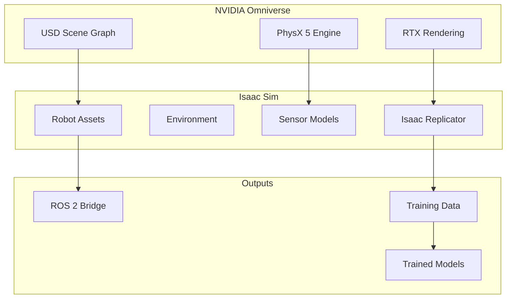
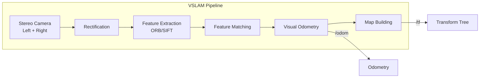
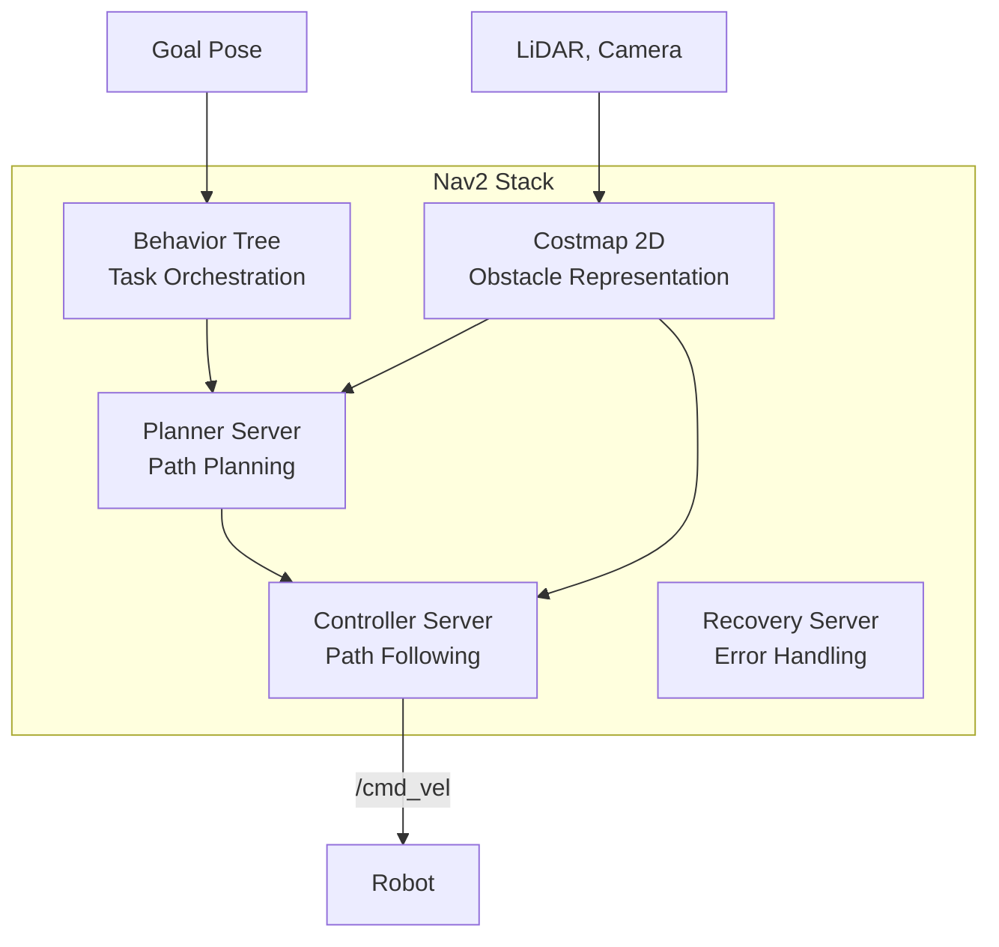

---
sidebar_position: 5
title: 'Weeks 8-10: NVIDIA Isaac Platform'
description: 'Isaac Sim, Isaac ROS, Perception, and Sim-to-Real Transfer'
---


---

import { PersonalizationButton, UrduTranslationButton, ButtonContainer } from '@site/src/components/ModuleButtons';

<ButtonContainer>
  <PersonalizationButton />
  <UrduTranslationButton />
</ButtonContainer>

# 🧠 NVIDIA Isaac Platform


:::info Weekly Overview
| Week | Focus | Key Topics |
|------|-------|------------|
| **Week 8** | Isaac Sim | Omniverse, USD, Synthetic Data Generation |
| **Week 9** | Isaac ROS | VSLAM, Nvblox, GPU-accelerated perception |
| **Week 10** | Navigation | Nav2, Sim-to-Real, Reinforcement Learning |
:::

---## 📆 Week 8: NVIDIA Isaac Sim

### What is Isaac Sim?

Isaac Sim is built on **NVIDIA Omniverse** and uses the **USD (Universal Scene Description)** format from Pixar.

| Feature | Description |
|---------|-------------|
| **Photorealistic Rendering** | RTX ray-traced visuals |
| **Physics Engine** | PhysX 5 for accurate dynamics |
| **Sensor Simulation** | Cameras, LiDAR, IMU with noise models |
| **Synthetic Data** | Automated dataset generation |
| **Domain Randomization** | Vary textures, lighting, positions |



### System Requirements

| Component | Minimum | Recommended |
|-----------|---------|-------------|
| **GPU** | RTX 4070 Ti (12GB) | RTX 4090 (24GB) |
| **CPU** | Intel i7-12700 | Intel i9-13900K |
| **RAM** | 32 GB | 64 GB |
| **Storage** | 500 GB SSD | 1 TB NVMe |
| **OS** | Ubuntu 22.04 | Ubuntu 22.04 |

### Isaac Replicator: Synthetic Data Generation

Generate thousands of training images with automatic annotations:

```python
import omni.replicator.core as rep

# Setup scene for synthetic data generation
with rep.new_layer():
    
    # Create camera
    camera = rep.create.camera(
        position=(0, 0, 3),
        look_at=(0, 0, 0)
    )
    
    # Create render product
    render_product = rep.create.render_product(camera, (1024, 1024))
    
    # Create objects with semantic labels
    cube = rep.create.cube(
        semantics=[("class", "box")],
        position=rep.distribution.uniform((-1, -1, 0.5), (1, 1, 0.5))
    )
    
    sphere = rep.create.sphere(
        semantics=[("class", "ball")],
        position=rep.distribution.uniform((-1, -1, 0.3), (1, 1, 0.3))
    )
    
    # Randomize lighting
    light = rep.create.light(
        light_type="distant",
        intensity=rep.distribution.uniform(500, 2000),
        rotation=rep.distribution.uniform((0, 0, 0), (90, 90, 90))
    )
    
    # Randomize textures
    with cube:
        rep.randomizer.texture(
            textures=rep.utils.get_usd_files("/textures/wood/"),
            project_uvw=True
        )
    
    # Setup writer for annotations
    writer = rep.WriterRegistry.get("BasicWriter")
    writer.initialize(
        output_dir="/datasets/robot_perception/",
        rgb=True,
        bounding_box_2d_tight=True,
        semantic_segmentation=True,
        instance_segmentation=True,
        distance_to_camera=True
    )
    writer.attach([render_product])
    
    # Generate 10,000 frames
    with rep.trigger.on_frame(num_frames=10000):
        rep.randomizer.scatter_2d(cube, surface=floor)
        rep.randomizer.scatter_2d(sphere, surface=floor)

# Run generation
rep.orchestrator.run()
```

---## 📆 Week 9: Isaac ROS (Hardware-Accelerated Perception)

### Isaac ROS Packages

Deploy GPU-accelerated perception on Jetson hardware:

| Package | Function | Speedup |
|---------|----------|---------|
| **Isaac ROS VSLAM** | Visual SLAM | 10x vs CPU |
| **Isaac ROS DNN** | Object detection | 5x vs CPU |
| **Isaac ROS Nvblox** | 3D reconstruction | Real-time |
| **Isaac ROS AprilTag** | Fiducial detection | 3x vs CPU |
| **Isaac ROS Depth Segmentation** | Obstacle detection | Real-time |

### VSLAM (Visual SLAM)




```yaml
# isaac_ros_vslam_params.yaml
vslam_node:
  ros__parameters:
    # Input configuration
    enable_rectified_pose: true
    denoise_input_images: true
    rectified_images: false
    
    # Camera configuration
    camera_frame: "camera"
    base_frame: "base_link"
    odom_frame: "odom"
    map_frame: "map"
    
    # Performance tuning
    enable_slam_visualization: true
    enable_observations_view: true
    enable_landmarks_view: true
    
    # Quality settings
    path_max_size: 1000
    enable_localization_n_mapping: true
```

### Nvblox: Real-Time 3D Reconstruction

Build occupancy maps for obstacle avoidance:

```python
# Launch Nvblox with RealSense
from launch import LaunchDescription
from launch_ros.actions import ComposableNodeContainer
from launch_ros.descriptions import ComposableNode

def generate_launch_description():
    nvblox_node = ComposableNode(
        package='nvblox_ros',
        plugin='nvblox::NvbloxNode',
        name='nvblox_node',
        parameters=[{
            'global_frame': 'odom',
            'voxel_size': 0.05,
            'max_tsdf_update_hz': 10.0,
            'max_color_update_hz': 5.0,
            'max_mesh_update_hz': 5.0,
            'esdf': True,  # Euclidean Signed Distance Field
            'esdf_2d': True,  # For 2D costmap
            'distance_slice': True,
            'slice_height': 1.0,
        }],
        remappings=[
            ('depth/image', '/camera/depth/image_rect_raw'),
            ('depth/camera_info', '/camera/depth/camera_info'),
            ('color/image', '/camera/color/image_raw'),
            ('color/camera_info', '/camera/color/camera_info'),
        ]
    )
    
    container = ComposableNodeContainer(
        name='nvblox_container',
        namespace='',
        package='rclcpp_components',
        executable='component_container_mt',
        composable_node_descriptions=[nvblox_node],
        output='screen',
    )
    
    return LaunchDescription([container])
```

---## 📆 Week 10: Navigation and Sim-to-Real Transfer

### Nav2: The ROS 2 Navigation Stack



### Navigation Parameters for Humanoids

```yaml
# nav2_params.yaml
planner_server:
  ros__parameters:
    planner_plugins: ["GridBased"]
    GridBased:
      plugin: "nav2_navfn_planner/NavfnPlanner"
      tolerance: 0.5
      use_astar: true
      allow_unknown: true

controller_server:
  ros__parameters:
    controller_plugins: ["FollowPath"]
    FollowPath:
      plugin: "dwb_core::DWBLocalPlanner"
      min_vel_x: -0.1
      max_vel_x: 0.3  # Slower for bipedal stability
      max_vel_theta: 0.5
      min_speed_xy: 0.0
      max_speed_xy: 0.3
      min_speed_theta: 0.0
      acc_lim_x: 0.5
      acc_lim_theta: 1.0
      decel_lim_x: -0.5
      decel_lim_theta: -1.0

local_costmap:
  local_costmap:
    ros__parameters:
      update_frequency: 5.0
      publish_frequency: 2.0
      global_frame: odom
      robot_base_frame: base_link
      rolling_window: true
      width: 3
      height: 3
      resolution: 0.05
      # Humanoid footprint (narrow)
      footprint: "[[0.15, 0.08], [0.15, -0.08], [-0.15, -0.08], [-0.15, 0.08]]"
```

### Sim-to-Real Transfer Techniques

| Technique | Description | Use Case |
|-----------|-------------|----------|
| **Domain Randomization** | Vary sim conditions | Robust perception |
| **System Identification** | Match sim to real physics | Accurate dynamics |
| **Progressive Training** | Increase difficulty gradually | Motor control |
| **Real2Sim2Real** | Use real data to improve sim | Closing the gap |

### Reinforcement Learning for Robot Control

```python
# Example: PPO Training with Isaac Gym
from omni.isaac.gym.vec_env import VecEnvBase
from omni.isaac.core.articulations import ArticulationView
import torch

class HumanoidEnv(VecEnvBase):
    def __init__(self, num_envs, device):
        super().__init__(num_envs, device)
        
        # Define observation and action spaces
        self.num_observations = 48  # Joint positions, velocities, IMU
        self.num_actions = 12  # Joint torques
        
    def get_observations(self):
        # Get joint states
        joint_positions = self.humanoids.get_joint_positions()
        joint_velocities = self.humanoids.get_joint_velocities()
        
        # Get IMU data
        root_lin_vel = self.humanoids.get_linear_velocities()
        root_ang_vel = self.humanoids.get_angular_velocities()
        
        obs = torch.cat([
            joint_positions,
            joint_velocities,
            root_lin_vel,
            root_ang_vel
        ], dim=-1)
        
        return obs
    
    def compute_reward(self):
        # Reward for forward velocity
        forward_reward = self.root_velocities[:, 0]  # x velocity
        
        # Penalty for falling
        fall_penalty = torch.where(
            self.root_positions[:, 2] < 0.5,  # If height < 0.5m
            torch.ones_like(forward_reward) * -100,
            torch.zeros_like(forward_reward)
        )
        
        # Energy penalty
        energy_penalty = torch.sum(self.actions ** 2, dim=-1) * 0.01
        
        reward = forward_reward + fall_penalty - energy_penalty
        return reward
```

---## 🎯 Learning Outcomes for Weeks 8-10

By the end of these weeks, you will:

- [x] Use **Isaac Sim** for photorealistic robot simulation
- [x] Generate **synthetic training data** with Isaac Replicator
- [x] Deploy **GPU-accelerated VSLAM** on Jetson
- [x] Build real-time **3D costmaps** with Nvblox
- [x] Configure **Nav2** for humanoid navigation
- [x] Apply **Sim-to-Real transfer** techniques
- [x] Understand **reinforcement learning** for robot control

---## 📝 Assessment: Isaac-Based Perception Pipeline

### Requirements

| Component | Description | Points |
|-----------|-------------|--------|
| **Isaac Sim World** | Custom environment with obstacles | 20 |
| **Synthetic Dataset** | 1000+ annotated images | 25 |
| **VSLAM Deployment** | Working localization on Jetson | 25 |
| **Navigation** | Point-to-point navigation with Nav2 | 30 |

### Deliverables

1. Isaac Sim project with custom world
2. Generated dataset with annotations
3. VSLAM launch configuration
4. Video of robot navigating autonomously

---## 🔗 Resources

- [NVIDIA Isaac Sim Documentation](https://docs.omniverse.nvidia.com/isaacsim/)
- [Isaac ROS GitHub](https://github.com/NVIDIA-ISAAC-ROS)
- [Nav2 Documentation](https://navigation.ros.org/)
- [Isaac Gym](https://developer.nvidia.com/isaac-gym)
