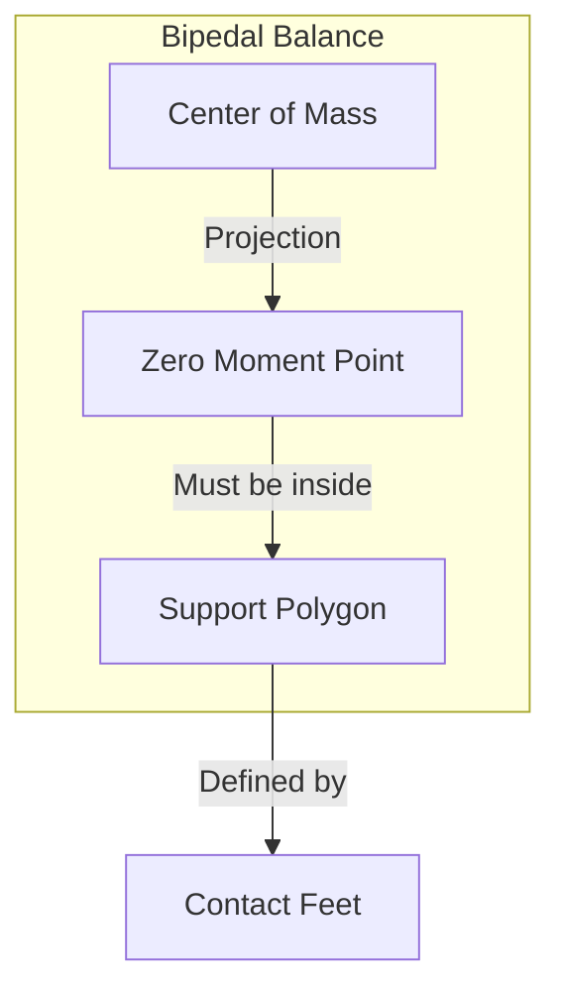

---
sidebar_position: 6
title: 'Weeks 11-12: Humanoid Robot Development'
description: 'Kinematics, Dynamics, Bipedal Locomotion, and Manipulation'
---


---

import { PersonalizationButton, UrduTranslationButton, ButtonContainer } from '@site/src/components/ModuleButtons';

<ButtonContainer>
  <PersonalizationButton />
  <UrduTranslationButton />
</ButtonContainer>

# 🦿 Humanoid Robot Development


:::info Weekly Overview
| Week | Focus | Key Topics |
|------|-------|------------|
| **Week 11** | Kinematics & Dynamics | Forward/Inverse kinematics, Dynamics |
| **Week 12** | Locomotion & Manipulation | Bipedal walking, Grasping |
:::

---## 📆 Week 11: Humanoid Robot Kinematics and Dynamics

### Robot Kinematics


```mermaid
graph LR
    subgraph "Forward Kinematics"
        JA1[Joint Angles<br/>θ₁, θ₂, θ₃...] --> FK[FK Algorithm]
        FK --> EP1[End Effector<br/>Position (x,y,z)]
    end
    
    subgraph "Inverse Kinematics"
        EP2[Target Position<br/>(x,y,z)] --> IK[IK Algorithm]
        IK --> JA2[Joint Angles<br/>θ₁, θ₂, θ₃...]
    end
```

### Forward Kinematics with DH Parameters

| Link | θ (angle) | d (offset) | a (length) | α (twist) |
|------|-----------|------------|------------|-----------|
| 1 (Hip) | θ₁ | 0 | 0 | -90° |
| 2 (Thigh) | θ₂ | 0 | 0.4m | 0° |
| 3 (Shin) | θ₃ | 0 | 0.4m | 0° |
| 4 (Ankle) | θ₄ | 0 | 0 | 90° |

```python
import numpy as np
from scipy.spatial.transform import Rotation

def dh_transform(theta, d, a, alpha):
    """Compute Denavit-Hartenberg transformation matrix."""
    ct, st = np.cos(theta), np.sin(theta)
    ca, sa = np.cos(alpha), np.sin(alpha)
    
    return np.array([
        [ct, -st*ca,  st*sa, a*ct],
        [st,  ct*ca, -ct*sa, a*st],
        [0,   sa,     ca,    d],
        [0,   0,      0,     1]
    ])

def forward_kinematics(joint_angles, dh_params):
    """Compute end-effector pose from joint angles."""
    T = np.eye(4)
    
    for i, (theta, d, a, alpha) in enumerate(dh_params):
        theta_i = theta + joint_angles[i]
        T_i = dh_transform(theta_i, d, a, alpha)
        T = T @ T_i
    
    return T

# Example: 4-DOF leg
dh_params = [
    (0, 0, 0, -np.pi/2),      # Hip yaw
    (0, 0, 0.4, 0),            # Hip pitch (thigh)
    (0, 0, 0.4, 0),            # Knee
    (0, 0, 0, np.pi/2),        # Ankle
]

joint_angles = [0, -0.3, 0.6, -0.3]  # radians
foot_pose = forward_kinematics(joint_angles, dh_params)
print(f"Foot position: {foot_pose[:3, 3]}")
```

### Inverse Kinematics (IK)

```python
from scipy.optimize import minimize

def inverse_kinematics(target_position, dh_params, initial_guess=None):
    """Solve IK using numerical optimization."""
    
    if initial_guess is None:
        initial_guess = np.zeros(len(dh_params))
    
    def cost_function(joint_angles):
        T = forward_kinematics(joint_angles, dh_params)
        current_position = T[:3, 3]
        error = np.linalg.norm(target_position - current_position)
        return error
    
    # Joint limits
    bounds = [(-np.pi, np.pi) for _ in range(len(dh_params))]
    
    result = minimize(
        cost_function,
        initial_guess,
        method='SLSQP',
        bounds=bounds,
        options={'ftol': 1e-6}
    )
    
    return result.x

# Example: Move foot to target position
target = np.array([0.2, 0.1, -0.6])
joint_solution = inverse_kinematics(target, dh_params)
print(f"Joint angles: {np.degrees(joint_solution)}")
```

### Robot Dynamics


#### Equations of Motion

```latex
M(q)\ddot{q} + C(q, \dot{q})\dot{q} + g(q) = \tau + J^T F_{ext}
```

| Term | Description |
|------|-------------|
| `$M(q)$` | Mass/inertia matrix |
| `$C(q, \dot{q})$` | Coriolis/centrifugal terms |
| `$g(q)$` | Gravity vector |
| `$\tau$` | Joint torques (control input) |
| `$J^T F_{ext}$` | External forces (contacts) |

```python
import pinocchio as pin

class HumanoidDynamics:
    def __init__(self, urdf_path):
        self.model = pin.buildModelFromUrdf(urdf_path)
        self.data = self.model.createData()
    
    def compute_dynamics(self, q, v, tau):
        """Compute forward dynamics: accelerations from torques."""
        # a = M^{-1}(tau - C*v - g)
        a = pin.aba(self.model, self.data, q, v, tau)
        return a
    
    def compute_inverse_dynamics(self, q, v, a):
        """Compute inverse dynamics: torques from accelerations."""
        # tau = M*a + C*v + g
        tau = pin.rnea(self.model, self.data, q, v, a)
        return tau
    
    def compute_gravity_compensation(self, q):
        """Compute torques to hold position against gravity."""
        v = np.zeros(self.model.nv)
        a = np.zeros(self.model.nv)
        return pin.rnea(self.model, self.data, q, v, a)
```

---## 📆 Week 12: Bipedal Locomotion and Manipulation

### Bipedal Locomotion

#### Zero Moment Point (ZMP)

The **ZMP** is the point where the total inertial and gravitational forces produce zero moment.



```python
class BipedalController:
    """Simplified bipedal locomotion controller."""
    
    def __init__(self):
        self.step_height = 0.05  # meters
        self.step_length = 0.15  # meters
        self.step_duration = 0.5  # seconds
        self.stance_leg = 'left'
    
    def compute_zmp(self, com_pos, com_vel, com_acc, gravity=9.81):
        """Compute Zero Moment Point."""
        z = com_pos[2]  # COM height
        
        zmp_x = com_pos[0] - (z / gravity) * com_acc[0]
        zmp_y = com_pos[1] - (z / gravity) * com_acc[1]
        
        return np.array([zmp_x, zmp_y])
    
    def generate_foot_trajectory(self, phase, start_pos, end_pos):
        """Generate swing foot trajectory using cubic spline."""
        # Horizontal interpolation
        x = start_pos[0] + (end_pos[0] - start_pos[0]) * phase
        y = start_pos[1] + (end_pos[1] - start_pos[1]) * phase
        
        # Vertical trajectory (parabola)
        z = self.step_height * 4 * phase * (1 - phase)
        
        return np.array([x, y, z + start_pos[2]])
    
    def walking_gait(self, time, velocity):
        """Generate walking gait for given velocity."""
        phase = (time % self.step_duration) / self.step_duration
        step_count = int(time / self.step_duration)
        
        if step_count % 2 == 0:
            # Left leg swing
            swing_leg = 'left'
            stance_leg = 'right'
        else:
            # Right leg swing
            swing_leg = 'right'
            stance_leg = 'left'
        
        return {
            'phase': phase,
            'swing_leg': swing_leg,
            'stance_leg': stance_leg,
            'target_velocity': velocity
        }
```

### Walking Phases

| Phase | Description | Duration |
|-------|-------------|----------|
| **Double Support** | Both feet on ground | 10-20% |
| **Single Support (Left)** | Right leg swinging | 40-45% |
| **Single Support (Right)** | Left leg swinging | 40-45% |

### Manipulation and Grasping

#### Grasp Planning

```python
class GraspPlanner:
    """Plan stable grasps for humanoid hands."""
    
    def __init__(self, hand_model):
        self.hand = hand_model
        self.grasp_types = ['power', 'precision', 'lateral']
    
    def compute_grasp_pose(self, object_pose, object_shape):
        """Compute stable grasp pose for object."""
        
        if object_shape['type'] == 'cylinder':
            # Power grasp around cylinder
            approach_direction = np.array([1, 0, 0])
            grasp_width = object_shape['radius'] * 2
            
        elif object_shape['type'] == 'box':
            # Grasp narrowest dimension
            dims = object_shape['dimensions']
            min_dim_idx = np.argmin(dims)
            grasp_width = dims[min_dim_idx]
            
        elif object_shape['type'] == 'sphere':
            # Precision grasp
            grasp_width = object_shape['radius'] * 1.5
        
        # Compute hand pose relative to object
        grasp_pose = self.compute_approach_pose(
            object_pose,
            approach_direction,
            grasp_width
        )
        
        return grasp_pose
    
    def compute_finger_positions(self, grasp_width):
        """Compute finger joint angles for grasp width."""
        # Simplified two-finger gripper
        max_width = 0.1  # 10cm max opening
        ratio = grasp_width / max_width
        
        finger_angle = (1 - ratio) * np.pi / 4  # 0 to 45 degrees
        
        return {
            'left_finger': finger_angle,
            'right_finger': finger_angle
        }
```

### Natural Human-Robot Interaction Design

| Interaction Type | Sensors Required | Response |
|------------------|------------------|----------|
| **Speech** | Microphone array | Voice response, action |
| **Gesture** | RGB-D camera | Gesture recognition |
| **Eye Contact** | Face tracking | Gaze following |
| **Touch** | Force sensors | Compliance, safety stop |

---## 🎯 Learning Outcomes for Weeks 11-12

By the end of these weeks, you will:

- [x] Implement **forward and inverse kinematics**
- [x] Understand **robot dynamics** and equations of motion
- [x] Apply **gravity compensation** for posture holding
- [x] Implement **ZMP-based** bipedal balance control
- [x] Generate **walking gaits** with foot trajectories
- [x] Plan **stable grasps** for object manipulation
- [x] Design **natural human-robot interactions**

---## 📝 Assessment: Humanoid Development Project

### Requirements

| Component | Description | Points |
|-----------|-------------|--------|
| **IK Solver** | Working inverse kinematics for arm | 25 |
| **Walking Gait** | Stable walking in simulation | 30 |
| **Grasp Planning** | Pick up object successfully | 25 |
| **Integration** | Walk to object and pick it up | 20 |

### Deliverables

1. Python IK solver with visualization
2. Gazebo simulation of walking humanoid
3. Grasp planning demonstration
4. Video of complete pick-and-place task

---## 🔗 Resources

- [Pinocchio (Rigid Body Dynamics)](https://gepettoweb.laas.fr/doc/stack-of-tasks/pinocchio/)
- [MuJoCo Physics Engine](https://mujoco.org/)
- [RBDL (Rigid Body Dynamics Library)](https://rbdl.github.io/)
- [Humanoid Robotics: A Reference](https://www.springer.com/gp/book/9783662438671)
