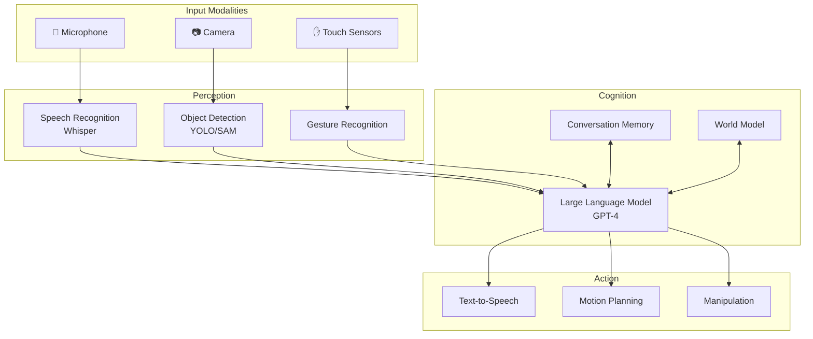
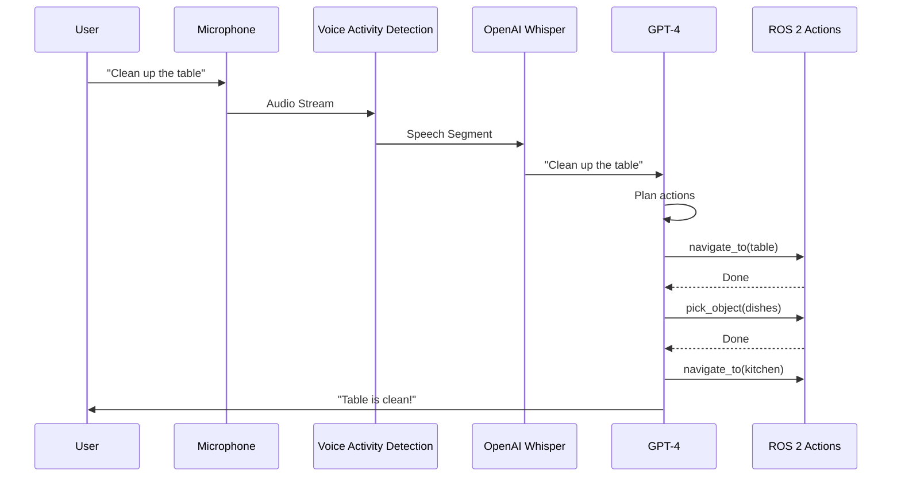
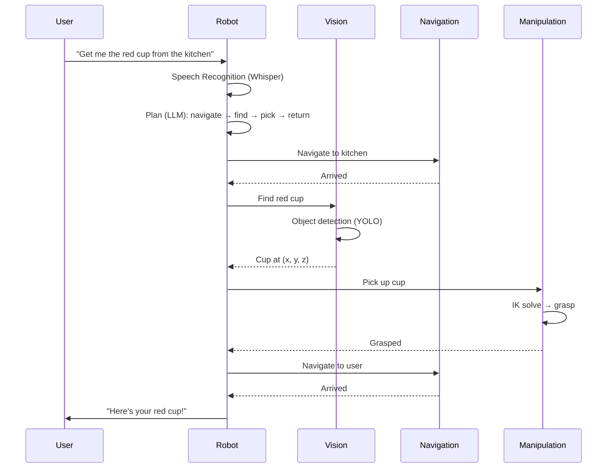

---
sidebar_position: 7
title: 'Week 13: Conversational Robotics'
description: 'GPT Integration, Speech Recognition, and Multi-Modal Interaction'
---


---

import { PersonalizationButton, UrduTranslationButton, ButtonContainer } from '@site/src/components/ModuleButtons';

<ButtonContainer>
  <PersonalizationButton />
  <UrduTranslationButton />
</ButtonContainer>

# 🗣️ Conversational Robotics


:::info Week Overview
| Topic | Description |
|-------|-------------|
| **GPT Integration** | Using LLMs for cognitive planning |
| **Speech Recognition** | OpenAI Whisper for voice commands |
| **Multi-Modal Interaction** | Speech, gesture, and vision fusion |
| **Capstone Preview** | The Autonomous Humanoid project |
:::

---## 🤖 Integrating GPT Models for Conversational AI

### The Conversational Robot Architecture



### LLM as Cognitive Planner


```python
import openai
from rclpy.node import Node
from nav2_msgs.action import NavigateToPose
from geometry_msgs.msg import PoseStamped
import json

class CognitiveRobotBrain(Node):
    """LLM-powered cognitive planning for humanoid robots."""
    
    def __init__(self):
        super().__init__('cognitive_brain')
        
        # OpenAI client
        self.openai_client = openai.OpenAI()
        
        # Conversation history
        self.conversation_history = []
        
        # World knowledge
        self.known_locations = {
            'kitchen': {'x': 5.0, 'y': 2.0},
            'living_room': {'x': 0.0, 'y': 0.0},
            'bedroom': {'x': -3.0, 'y': 4.0},
            'office': {'x': 2.0, 'y': -3.0}
        }
        
        self.known_objects = {
            'coffee_mug': 'kitchen counter',
            'book': 'living room table',
            'phone': 'office desk'
        }
    
    def plan_actions(self, user_command: str) -> list:
        """Use LLM to break down command into executable actions."""
        
        system_prompt = """You are a robot action planner for a humanoid robot.
        
Given a natural language command, output a JSON object with an "actions" array.

Available actions:
- {"action": "navigate_to", "location": "<location_name>"}
- {"action": "pick_object", "object": "<object_name>"}
- {"action": "place_object", "location": "<location_name>"}
- {"action": "speak", "message": "<text to say>"}
- {"action": "look_at", "target": "<object or location>"}
- {"action": "wait", "duration": <seconds>}

Known locations: kitchen, living_room, bedroom, office
Known objects: coffee_mug, book, phone

Example:
User: "Bring me the coffee mug from the kitchen"
Output: {
  "plan_explanation": "I'll go to the kitchen, get the coffee mug, and bring it back.",
  "actions": [
    {"action": "speak", "message": "I'll get the coffee mug for you"},
    {"action": "navigate_to", "location": "kitchen"},
    {"action": "look_at", "target": "coffee_mug"},
    {"action": "pick_object", "object": "coffee_mug"},
    {"action": "navigate_to", "location": "living_room"},
    {"action": "speak", "message": "Here's your coffee mug"}
  ]
}

Always explain your plan and be helpful."""
        
        # Add to conversation history
        self.conversation_history.append({
            "role": "user",
            "content": user_command
        })
        
        response = self.openai_client.chat.completions.create(
            model="gpt-4o",
            messages=[
                {"role": "system", "content": system_prompt},
                *self.conversation_history
            ],
            response_format={"type": "json_object"}
        )
        
        result = json.loads(response.choices[0].message.content)
        
        # Add assistant response to history
        self.conversation_history.append({
            "role": "assistant",
            "content": response.choices[0].message.content
        })
        
        self.get_logger().info(f"Plan: {result.get('plan_explanation', '')}")
        
        return result.get("actions", [])
    
    async def execute_action(self, action: dict):
        """Execute a single planned action."""
        action_type = action["action"]
        
        if action_type == "navigate_to":
            location = action["location"]
            coords = self.known_locations.get(location)
            if coords:
                await self.navigate_to_position(coords['x'], coords['y'])
                
        elif action_type == "pick_object":
            obj = action["object"]
            await self.pick_up_object(obj)
            
        elif action_type == "speak":
            message = action["message"]
            await self.text_to_speech(message)
            
        elif action_type == "look_at":
            target = action["target"]
            await self.look_at_target(target)
            
        elif action_type == "wait":
            duration = action["duration"]
            await asyncio.sleep(duration)
```

---## 🎤 Speech Recognition with OpenAI Whisper

### Voice-to-Action Pipeline



### Whisper Integration

```python
import whisper
import sounddevice as sd
import numpy as np
from queue import Queue
from threading import Thread

class VoiceInterface(Node):
    """Real-time voice command processing with Whisper."""
    
    def __init__(self):
        super().__init__('voice_interface')
        
        # Load Whisper model (choose based on hardware)
        # tiny, base, small, medium, large
        self.whisper_model = whisper.load_model("base")
        
        # Audio configuration
        self.sample_rate = 16000
        self.chunk_duration = 0.5  # seconds
        self.audio_queue = Queue()
        
        # Voice activity detection threshold
        self.energy_threshold = 0.01
        self.silence_duration = 1.0  # seconds of silence to end recording
        
        # Start audio capture thread
        self.recording = False
        self.audio_buffer = []
        self.start_audio_capture()
    
    def start_audio_capture(self):
        """Start continuous audio capture."""
        def audio_callback(indata, frames, time, status):
            if status:
                self.get_logger().warn(f"Audio status: {status}")
            self.audio_queue.put(indata.copy())
        
        self.stream = sd.InputStream(
            samplerate=self.sample_rate,
            channels=1,
            dtype='float32',
            callback=audio_callback,
            blocksize=int(self.sample_rate * self.chunk_duration)
        )
        self.stream.start()
        
        # Start processing thread
        self.processing_thread = Thread(target=self.process_audio_loop)
        self.processing_thread.daemon = True
        self.processing_thread.start()
    
    def process_audio_loop(self):
        """Continuously process audio for voice commands."""
        silence_chunks = 0
        max_silence_chunks = int(self.silence_duration / self.chunk_duration)
        
        while True:
            chunk = self.audio_queue.get()
            energy = np.sqrt(np.mean(chunk ** 2))
            
            if energy > self.energy_threshold:
                # Voice detected
                self.recording = True
                self.audio_buffer.append(chunk)
                silence_chunks = 0
                
            elif self.recording:
                # Silence during recording
                self.audio_buffer.append(chunk)
                silence_chunks += 1
                
                if silence_chunks >= max_silence_chunks:
                    # End of speech
                    self.recording = False
                    audio_data = np.concatenate(self.audio_buffer)
                    self.audio_buffer = []
                    
                    # Transcribe
                    self.transcribe_and_execute(audio_data)
    
    def transcribe_and_execute(self, audio_data: np.ndarray):
        """Transcribe audio and execute command."""
        # Whisper expects float32 audio
        audio_float = audio_data.flatten().astype(np.float32)
        
        # Transcribe
        result = self.whisper_model.transcribe(
            audio_float,
            language="en",
            fp16=False  # Set True for GPU
        )
        
        text = result["text"].strip()
        
        if text:
            self.get_logger().info(f"Heard: {text}")
            # Send to cognitive planner
            self.process_command(text)
    
    def process_command(self, text: str):
        """Process transcribed command."""
        # Publish to command topic
        msg = String()
        msg.data = text
        self.command_publisher.publish(msg)
```

---## 🎬 Multi-Modal Interaction

### Combining Speech, Gesture, and Vision

| Modality | Input | Processing | Output |
|----------|-------|------------|--------|
| **Speech** | Microphone | Whisper → LLM | Voice response |
| **Gesture** | RGB-D Camera | Pose estimation | Action trigger |
| **Gaze** | Eye tracker | Attention model | Object focus |
| **Touch** | Force sensors | Pressure analysis | Compliance mode |

```python
class MultiModalFusion(Node):
    """Fuse multiple input modalities for robust understanding."""
    
    def __init__(self):
        super().__init__('multimodal_fusion')
        
        # Subscribers for each modality
        self.create_subscription(String, '/speech/text', self.speech_cb, 10)
        self.create_subscription(PoseArray, '/gesture/poses', self.gesture_cb, 10)
        self.create_subscription(PointStamped, '/gaze/point', self.gaze_cb, 10)
        
        # State
        self.current_speech = None
        self.current_gesture = None
        self.gaze_target = None
        
        # Fusion timer
        self.create_timer(0.1, self.fuse_modalities)
    
    def fuse_modalities(self):
        """Fuse all modalities to understand user intent."""
        
        # Example: "Put [pointing gesture] there [looking at shelf]"
        if self.current_speech and "there" in self.current_speech:
            if self.current_gesture == "pointing":
                # User is pointing at something
                source_object = self.detect_pointed_object()
                
            if self.gaze_target:
                # User is looking at destination
                destination = self.gaze_target
                
                # Generate action
                self.execute_put_action(source_object, destination)
    
    def speech_cb(self, msg):
        self.current_speech = msg.data
        self.speech_timestamp = self.get_clock().now()
    
    def gesture_cb(self, msg):
        # Classify gesture from pose
        self.current_gesture = self.classify_gesture(msg)
    
    def gaze_cb(self, msg):
        self.gaze_target = self.raycast_to_object(msg.point)
```

---## 🎯 Capstone Project: The Autonomous Humanoid

### Project Overview




### Success Criteria

| Criterion | Description | Points |
|-----------|-------------|--------|
| **Language Understanding** | Interprets vague natural language | 25 |
| **Navigation** | Navigates without collision | 25 |
| **Object Detection** | Identifies target with >90% confidence | 25 |
| **Manipulation** | Successfully grasps object | 25 |

### Example Commands to Test

1. *"Get me the blue cup from the counter"*
2. *"Put this book on the shelf"*
3. *"Find my keys"*
4. *"Clean up the table"*
5. *"Follow me to the living room"*

### Evaluation Rubric

| Component | Excellent (A) | Good (B) | Satisfactory (C) |
|-----------|---------------|----------|------------------|
| **Speech** | Handles accents, noise | Clear speech works | Single keywords |
| **Planning** | Multi-step complex tasks | 3-4 step tasks | Single actions |
| **Navigation** | Dynamic obstacle avoidance | Static obstacles | Open space only |
| **Manipulation** | Various objects | Single object type | Scripted grasp |

---## 🎯 Learning Outcomes for Week 13

By the end of this week, you will:

- [x] Integrate **GPT models** for cognitive planning
- [x] Implement **speech recognition** with OpenAI Whisper
- [x] Design **multi-modal interaction** systems
- [x] Understand **natural language understanding** in robotics
- [x] Build end-to-end **voice-to-action** pipelines
- [x] Complete the **Autonomous Humanoid** capstone

---## 📝 Final Capstone Assessment

### Deliverables

| Component | Weight |
|-----------|--------|
| **Demo Video** (< 3 minutes) | 30% |
| **Code Repository** | 25% |
| **Technical Documentation** | 20% |
| **Live Q&A Presentation** | 15% |
| **Creativity & Innovation** | 10% |

### Submission Requirements

1. **GitHub Repository** with all code
2. **Demo Video** showing end-to-end operation
3. **README** with setup instructions
4. **Documentation** of architecture and design decisions

---## 🔗 Resources

- [OpenAI Whisper](https://github.com/openai/whisper)
- [OpenAI GPT-4 API](https://platform.openai.com/docs/guides/gpt)
- [LangChain for Robotics](https://python.langchain.com/)
- [Hugging Face Speech Models](https://huggingface.co/models?pipeline_tag=automatic-speech-recognition)
- [Multi-Modal Learning Resources](https://github.com/pliang279/awesome-multimodal-ml)
